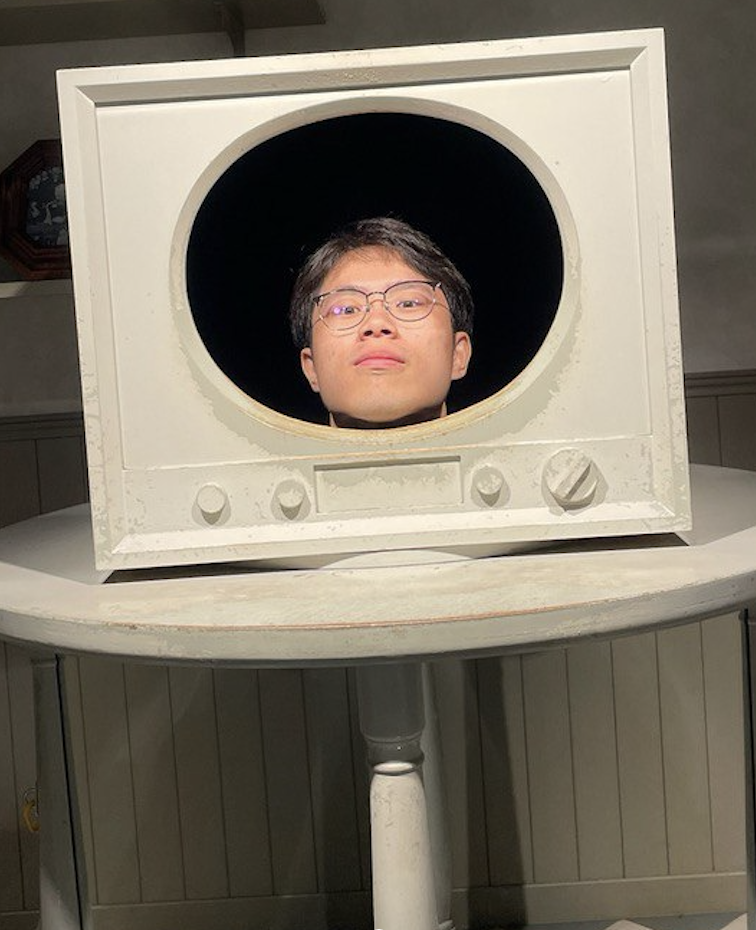
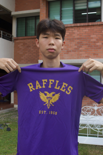
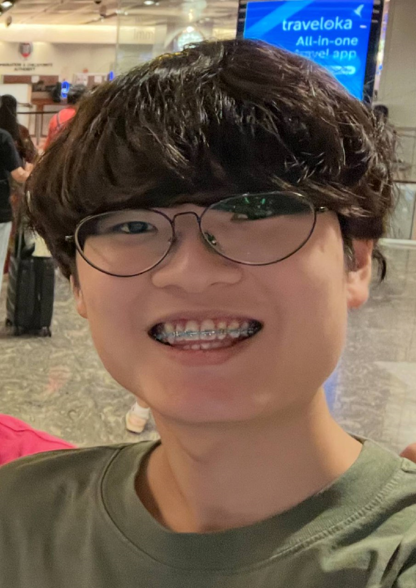

# About Us

We are a team based in the [School of Computing, National University of Singapore](http://www.comp.nus.edu.sg).

You can reach us at the email `dylan_wee_l_h_01@u.nus.edu`

## Project team

### Jarvis Chua

[[github](https://github.com/Qwertyblob)]

* Role: Developer
* Responsibilities: Features

### Dylan Wee Lee Hon

[[github](http://github.com/wylandee)]

* Role: Developer
* Responsibilities: UI

### Teo Shi Yuan

[[github](http://github.com/TeoShiYuan)]

* Role: Developer
* Responsibilities: Data

### Isaac Lee Kye Xen

[[github](http://github.com/ais555)]
[portfolio]

* Role: Developer
* Responsibilities: Dev Ops + Threading

### James Doe

[[github](http://github.com/johndoe)]
[[portfolio](team/johndoe.md)]

* Role: Developer
* Responsibilities: UI
