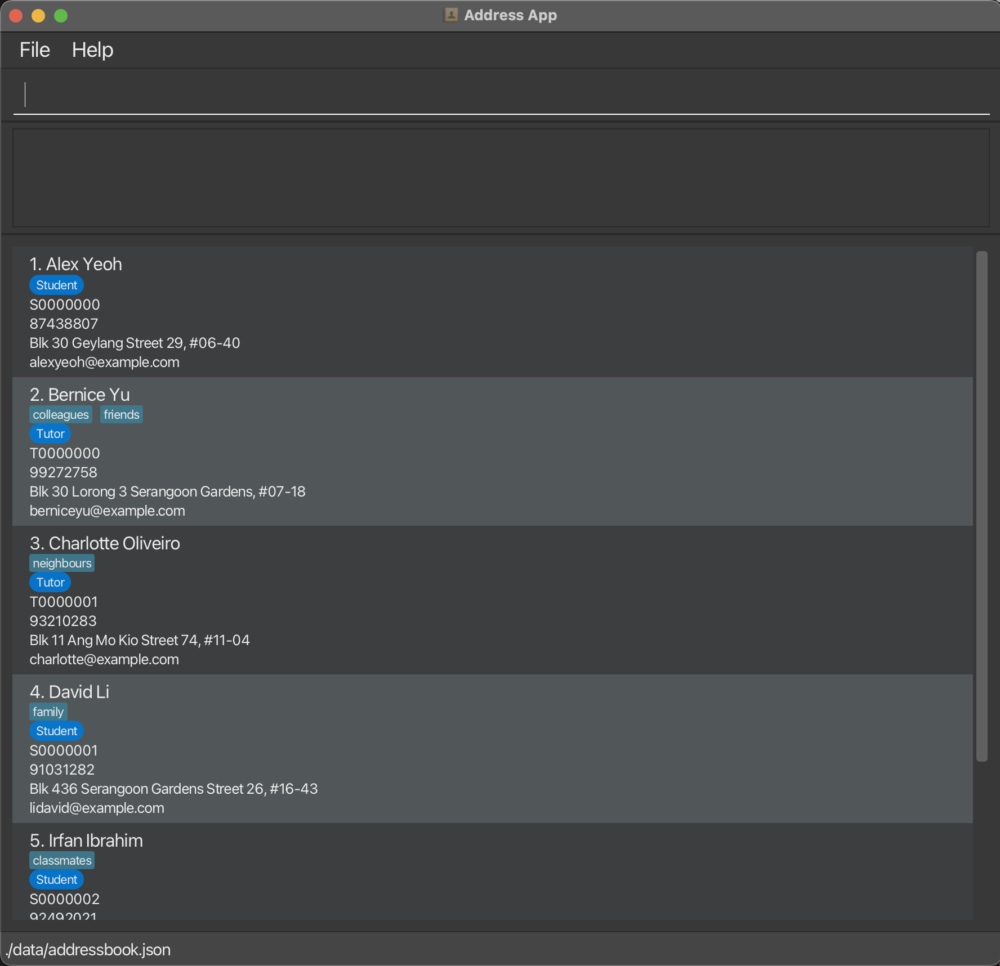
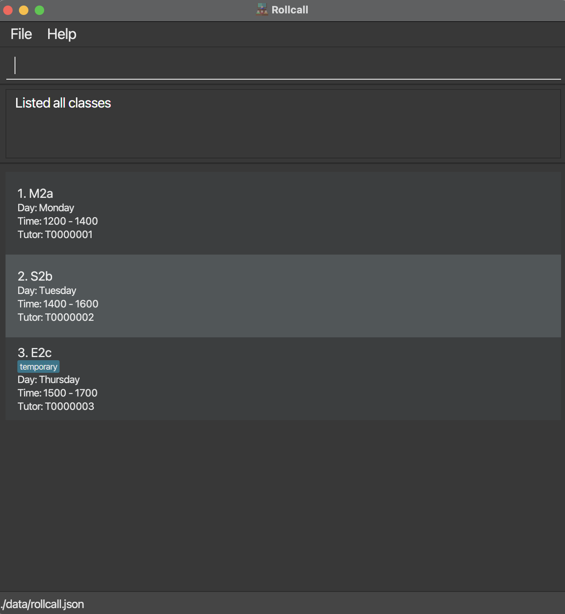
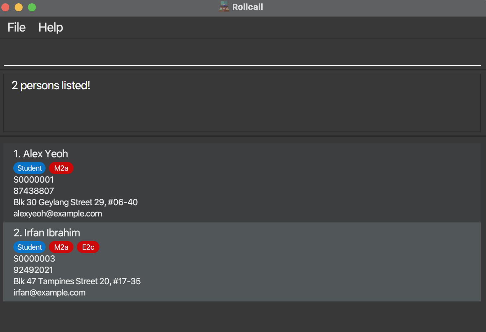
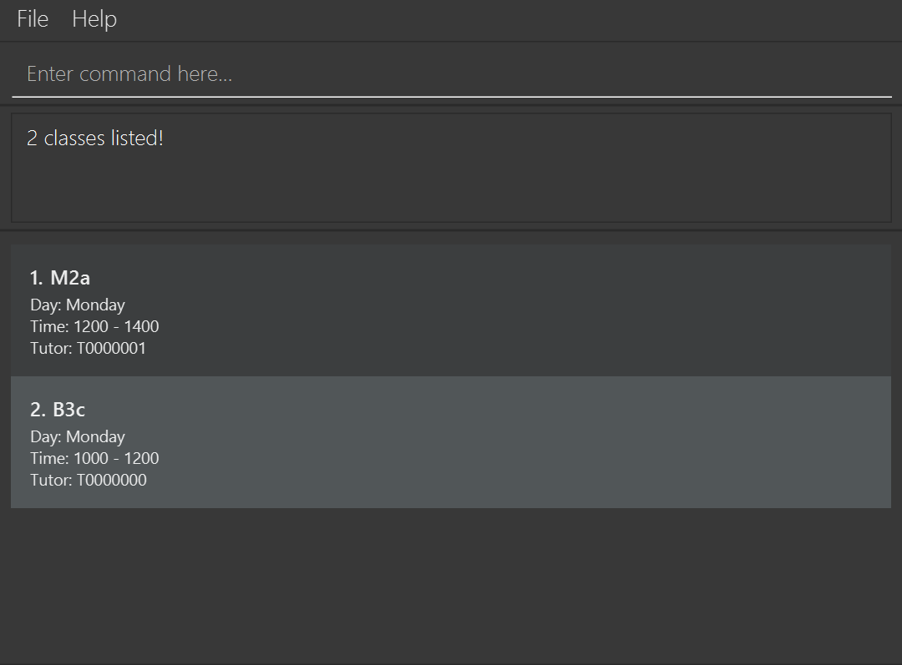

# Rollcall User Guide

**Rollcall** is a **lightweight**, **local** address-book tailored to **tuition centres** that lets admin staff **add**, **find**, **schedule,** and **manage** students and staff. With **simple** text commands, it is **faster** and more **intuitive** than other spreadsheet softwares. It includes all the **essential** HR features without the hassle and complexity of fullblown HR software.

<!-- * Table of Contents -->
<page-nav-print />

--------------------------------------------------------------------------------------------------------------------

## Quick start

1. Ensure you have Java `17` or above installed in your Computer.<br>
   **Mac users:** Ensure you have the precise JDK version prescribed [here](https://se-education.org/guides/tutorials/javaInstallationMac.html).

1. Download the latest `.jar` file from [here](https://github.com/AY2526S1-CS2103T-F14a-4/tp/releases).

1. Copy the file to the folder you want to use as the _home folder_ for your AddressBook.

1. Open a command terminal, `cd` into the folder you put the jar file in, and use the `java -jar addressbook.jar` command to run the application.<br>
   A GUI similar to the below should appear in a few seconds. Note how the app contains some sample data.<br>
   
   

1. Type the command in the command box and press Enter to execute it. e.g. typing **`help`** and pressing Enter will open the help window.<br>
   Some example commands you can try:

   * `list` : Lists all contacts.

   * `add n/John Doe r/Tutor p/98765432 e/johnd@example.com a/John street, block 123, #01-01` : Adds a contact named `John Doe` to the Address Book.

   * `delete 3` : Deletes the 3rd contact shown in the current list.

   * `listc` : Lists all classes

   * `addc c/M2a d/Monday tm/1200-1400 tt/T1234567` : Adds a class named M2a to the address book

   * `clear` : Deletes all contacts and classes.

   * `exit` : Exits the app.

1. Refer to the [Features](#features) below for details of each command.

--------------------------------------------------------------------------------------------------------------------

## Features

<box type="info" seamless>

**Notes about the command format:**<br>

* Words in `UPPER_CASE` are the parameters to be supplied by the user.<br>
  e.g. in `add n/NAME`, `NAME` is a parameter which can be used as `add n/John Doe`.

* Items in square brackets are optional.<br>
  e.g. `n/NAME [t/TAG]` can be used as `n/John Doe t/new` or as `n/John Doe`.

* Items with `…`​ after them can be used multiple times including zero times.<br>
  e.g. `[t/TAG]…​` can be used as ` ` (i.e. 0 times), `t/friend`, `t/friend t/family` etc.

* Parameters can be in any order.<br>
  e.g. if the command specifies `n/NAME p/PHONE_NUMBER`, `p/PHONE_NUMBER n/NAME` is also acceptable.

* Extraneous parameters for commands that do not take in parameters (such as `help`, `list`, `exit` and `clear`) will be ignored.<br>
  e.g. if the command specifies `help 123`, it will be interpreted as `help`.

* If you are using a PDF version of this document, be careful when copying and pasting commands that span multiple lines as space characters surrounding line-breaks may be omitted when copied over to the application.
</box>

### Viewing help : `help`

Shows a message explaining how to access the help page.


Format: `help`


### Adding a person: `add`

Adds a person to the address book.

Format: `add n/NAME r/ROLE p/PHONE_NUMBER e/EMAIL a/ADDRESS [t/TAG]…​`

* `NAME` must be alphabetical characters only.
* `ROLE` is only limited to "Student" or "Tutor" (case-insensitive).
* `PHONE_NUMBER` must only be 8-digit numbers starting with either "8" or "9".
* `EMAIL` must include a "@" followed by a domain name.
* When added, each person is assigned a unique ID with the following format:
  * Student: "S", followed by 7 numbers. e.g. S0000001.
  * Tutor: "T", followed by 7 numbers. e.g. T0000001.
* Duplicate people are identified as those with the same `NAME`, `PHONE_NUMBER` and `EMAIL`.
  * i.e. There can exist multiple people with the same `NAME`, they will be uniquely identified by their ID.

<box type="tip" seamless>

**Tip:** A person can have any number of tags (including 0)
</box>

Examples:
* `add n/John Doe r/Tutor p/98765432 e/johnd@example.com a/John street, block 123, #01-01`
* `add n/Betsy Crowe r/Student e/betsycrowe@example.com a/Newgate Prison p/1234567 t/criminal`

### Adding a class: `addc`

Adds a class to the address book.

Format: `addc c/CLASS_NAME d/DAY tm/TIME tt/TUTOR_ID [t/TAG]…​`

* `CLASS_NAME` follows the format: Uppercase alphabet, number, lowercase alphabet. e.g. M2a.
* `DAY` can only be the days of the week (e.g. Monday, Tuesday, etc.) and is case-insensitive.
* `TIME` must be 2 4-digit numbers in 24-hour format, separated by a "-". The end time must be later than the start time, and cannot cross over to the next day (e.g. 2100-0200).
* `TUTOR_ID` must follow the ID format stated in `add` and exist in the address book.
* If another class has the same `TUTOR_ID`, the `TIME` cannot overlap.
  * e.g. If `M2a, Monday, 1200-1400, T0000001` already exists in the address book, `S3b, Monday, 1300-1500, T0000001` cannot be added.

<box type="tip" seamless>

**Tip:** A class can have any number of tags (including 0)
</box>

Examples:
* `addc c/M2a d/Monday tm/1200-1400 tt/T1234567`
* `addc c/S3b d/Monday tm/1200-1500 tt/T1234567 t/temporary class`

### Listing all persons: `list`

Shows a list of all persons in the address book.

Format: `list`

### Listing all classes: `listc`

Shows a list of all classes in the address book.

Format: `listc`

### Editing a person: `edit`

Edits an existing person in the address book.

Format: `edit INDEX [n/NAME] [p/PHONE] [e/EMAIL] [a/ADDRESS] [t/TAG]…​`

* Edits the person at the specified `INDEX`. The index refers to the index number shown in the displayed person list. The index **must be a positive integer** 1, 2, 3, …​
* At least one of the optional fields must be provided.
* Existing values will be updated to the input values.
* When editing tags, the existing tags of the person will be removed i.e adding of tags is not cumulative.
* You can remove all the person’s tags by typing `t/` without
    specifying any tags after it.

<box type="warning" seamless>

**Warning:** Roles are not allowed to be edited. If you need to change the role of a person, please use `delete` and `add`.
</box>

Examples:
*  `edit 1 p/91234567 e/johndoe@example.com` Edits the phone number and email address of the 1st person to be `91234567` and `johndoe@example.com` respectively.
*  `edit 2 n/Betsy Crower t/` Edits the name of the 2nd person to be `Betsy Crower` and clears all existing tags.

### Editing a class: `editc`

Edits an existing class in the address book.

Format: `editc INDEX [c/CLASS_NAME] [d/DAY] [tm/TIME] [tt/TUTOR_ID] [t/TAG]…​`

* Edits the class at the specified `INDEX`. The index refers to the index number shown in the displayed class list. The index **must be a positive integer** 1, 2, 3, …​
* At least one of the optional fields must be provided.
* Existing values will be updated to the input values.
* When editing tags, the existing tags of the class will be removed i.e adding of tags is not cumulative.
* You can remove all the class’ tags by typing `t/` without
  specifying any tags after it.

Examples:
*  `edit 1 d/Tuesday tm/1500-1600` Edits the day and time of the 1st class to be `Tuesday` and `1500-1600` respectively.
*  `edit 2 c/S3b t/` Edits the name of the 2nd class to be `S3b` and clears all existing tags.

### Enrolling a person to a class: `enrol`

Enrols an existing person in the address book to an existing class.

Format: `enrol id/STUDENT_ID class/CLASS_NAME`

* The `STUDENT_ID` and `CLASS_NAME` must exist in the address book.
* Cannot enrol a student who is already enrolled into the specified class.
* Cannot enrol a student if they are already enrolled in another class that overlaps with the `TIME`.
  * e.g. If a student is already enrolled in `M2a, Monday, 1200-1400`, then they cannot be enrolled into `S3b, Monday, 1300-1500`.

Examples:
*  `enrol id/S0000001 c/M2a` Enrols the student with the student ID `S0000001` into the class `M2a`.

### Removing a person from a class: `unenrol`

Removes an existing person in the address book from an existing class.

Format: `unenrol id/STUDENT_ID class/CLASS_NAME`

* The `STUDENT_ID` and `CLASS_NAME` must exist in the address book.
* Cannot remove a student who is not enrolled into the specified class.

Examples:
*  `unenrol id/S0000001 c/M2a` Removes the student with the student ID `S0000001` from the class `M2a`.

### Marking a person's attendance in a class: `mark`

Marks an existing person's attendance in the address book in an existing class on the current day.

Format: `mark id/STUDENT_ID class/CLASS_NAME`

* The `STUDENT_ID` and `CLASS_NAME` must exist in the address book.
* The `STUDENT_ID` must be currently enrolled in `CLASS_NAME`.
* The student will be marked present only for the current day.
* Cannot mark a student who is already marked as present for the specified class on the same day.

Examples:
*  `mark id/S0000001 c/M2a` Marks the student with the student ID `S0000001` present in the class `M2a` on the current day.

### Unmarking a person's attendance in a class: `unmark`

Unmarks an existing person's attendance in the address book in an existing class on a particular day.

Format: `unmark id/STUDENT_ID class/CLASS_NAME [dt/DATE]`

* The `STUDENT_ID` and `CLASS_NAME` must exist in the address book.
* The `STUDENT_ID` must be currently marked present in `CLASS_NAME`.
* `DATE` format must be `yyyy-MM-dd`.
* If `DATE` is not specified, the current date will be unmarked if applicable, otherwise, the student will be unmarked only for the specified day.
* Cannot unmark a student who is not marked as present for the specified class on the specified day.

Examples:
*  `unmark id/S0000001 c/M2a dt/2025-11-11` Unmarks the student with the student ID `S0000001`'s attendance in the class `M2a` on `2025-11-11`.

### Searching of Contacts: `find`

Finds persons matching the given criteria.

Format: `find [id/ID] [n/NAME] [r/ROLE] [c/CLASS] [p/PHONE_NUMBER] [e/EMAIL] [a/ADDRESS] [t/TAG]​`

* At least one of the optional fields must be provided.
* Multiple parameters are also allowed to narrow down the search.
* The search is case-insensitive. e.g. `hans` will match `Hans`
* For `NAME`, `CLASS`, `TAG`, the order of the keywords does not matter. e.g. `n/Hans Bo` will match `n/Bo Hans`.
* Only full words will be matched e.g. `Han` will not match `Hans`
* Persons matching all criteria will be returned (i.e. `AND` search).
  e.g. `find n/John r/student` will return `John` with role `student`.
* Extra/leading/trailing spaces should not affect the search.

Examples:
* `find n/John` finds all names that contains `john`.
* `find n/John c/M2a` finds `John` in class `M2a`.
* `find id/S1234567` finds contact with id `S1234567`.
* `find r/student n/John` finds all students with name that contains `John`.

Example: `find c/M2a` Finds students in class M2a.


### Searching of Classes: `findc`

Finds classes matching the given criteria.

Format: `findc [c/CLASS] [d/DAY] [tm/TIME] [tt/TUTOR_ID] [t/TAG]​`

* At least one of the optional fields must be provided.
* Multiple parameters are also allowed to narrow down the search.
* The search is case-insensitive. e.g `m2a` will match `M2a`
* Only full words will be matched e.g. `Han` will not match `Hans`
* Classes matching all criteria will be returned (i.e. `AND` search).
  e.g. `findc d/monday tm/1200-1400` will return classes on `Monday` at time `1200-1400`.
* Extra/leading/trailing spaces should not affect the search.

<box type="warning" seamless>

**Warning:** For `TIME`, there should not be any spaces in between the start and end time. e.g. Use `tm/1200-1400` instead of `tm/1200 - 1400`.
</box>

Example: `findc d/monday` Finds classes on Monday.


### Deleting a person : `delete`

Deletes the specified person from the address book.

You may find this useful for students who have graduated, or tutors who have left the centre.

Format: `delete [-f] INDEX` or `delete [-f] n/NAME`

* Deletes the person at the specified `INDEX` or `NAME`.
* The index refers to the index number shown in the displayed person list.
* The `NAME` must be the full name of the person.
* The index **must be a positive integer** 1, 2, 3, …​
* Alternatively, deletes the person in the displayed list whose name matches the specified `NAME`.
* To prevent mistakes, Rollcall will request a response of either `Y` or `N` to confirm if you want to proceed.
* `-f` flag forces the command to execute without confirmation.

Examples:
* `list` followed by `delete 2` then `Y` deletes the 2nd person in the address book.
* `list` followed by `delete 2` then `N` cancels the command and does not delete anything.
* `find Betsy` followed by `delete 1` then `Y` deletes the 1st person in the results of the `find` command.
* `delete n/Alice Yeo` followed by `Y` deletes the person with the name `Alice Yeo` in the current displayed list.
* `delete -f n/Alice Yeo` deletes the person with the name `Alice Yeo` in the current displayed list without confirmation.

### Deleting a class : `deletec`

Deletes a class from the address book, but does not delete the people in the class.

You may find this useful if a class was created by mistake, or a class has been discontinued for any reason.

Format: `deletec [-f] INDEX` or `deletec [-f] c/CLASS_NAME`

* Deletes the class with the specified `INDEX` or `NAME`.
* To prevent mistakes, Rollcall will request a response of either `Y` or `N` to confirm if you want to proceed.
* `-f` flag forces the command to execute without confirmation.

Examples:
* `listc` followed by `deletec 3` then `Y` deletes the 3rd class in the address book.
* `deletec c/M2a` followed by `Y` deletes the class "M2a".
* `deletec c/S3b` followed by `N` cancels the command and does not delete anything.
* `deletec -f c/S3b` deletes the class "S3b" without confirmation.

### Clearing all entries : `clear`

Clears all entries (people and classes) from the address book.

Format: `clear [-f]`

* To prevent mistakes, Rollcall will request a response of either `Y` or `N` to confirm if you want to proceed.
* `-f` flag forces the command to execute without confirmation.

### Undoing a command : `undo`

Undoes the most recent command that is undoable.

Format: `undo`

* `undo` only executes if an undoable command has been executed before.
* Chaining undos executes undo on the next most recent undoable command.
* Undoable commands are those that alter the state of the address book.
* List of undoable commands:
  * `add`
  * `addc`
  * `edit`
  * `editc`
  * `enrol`
  * `unenrol`
  * `mark`
  * `unmark`
  * `delete`
  * `deletec`
  * `redo`
  * `clear`

Examples:

* User executes commands in this order: `add`, `list`, `edit`, `find`, `clear`
* `undo` undoes `clear`, restoring the address book before it was cleared.
* Executing another `undo` undoes `edit`, as `find` is not undoable and is skipped.
* Executing another `undo` undoes `add`, as `list` is not undoable and is skipped.

### Redoing an undone command: `redo`

Redoes the most recent undo command.

Format: `redo`

* `redo` only executes if an `undo` command has been executed before.
* Chaining redos executes redo on the next most recent `undo` command.

Examples:
* User executes commands in this order: `undo`, `list`, `undo`, `undo`
* `redo` redoes the most recent `undo`.
* Executing another `redo` redoes the next `undo`.
* Executing another `redo` redoes the next `undo`, as `list` is skipped.

### Importing data: `import`

Imports existing person and class lists from a JSON file.

Format `import FILE_PATH`

* The user can also click the File button on the GUI, then click Import to execute this command.
* This command overwrites whatever data is currently in the address book with the JSON data.
* FILE_PATH must exist.
* The JSON file must be in the appropriate format for the address book.
  * All people and classes must have their compulsory attributes.
  * Example: 
  ```
  {
  "persons" : [ {
    "id" : "S0000003",
    "name" : "Jarvis",
    "role" : "Student",
    "lessons" : [ "M2a", "S2b" ],
    "phone" : "98765432",
    "email" : "johnd@example.com",
    "address" : "311, Clementi Ave 2, #02-25",
    "tags" : [ ]
    } ],
  "lessons" : [ {
    "className" : "S2b",
    "day" : "Monday",
    "time" : "1200-1400",
    "tutor" : "T1234567",
    "students" : [ "S0000003", "S0000004", "S0000005" ],
    "attendance" : [ {
      "date" : "2025-10-21",
      "presentStudents" : [ "S0000001" ]
    } ],
    "tags" : [ ]
    } ]
  }
  ```
* The JSON file cannot be empty.

### Exporting data: `export`

Exports the person and class lists into a JSON file for backup.

Format `export FILE_PATH`

* The user can also click the File button on the GUI, then click Export to execute this command.
* FILE_PATH must exist.
* Cannot have a JSON file with a duplicate name in the target location.

### Exiting the program : `exit`

Exits the program.

Format: `exit`

### Saving the data

AddressBook data are saved in the hard disk automatically after any command that changes the data. There is no need to save manually.

### Editing the data file

AddressBook data are saved automatically as a JSON file `[JAR file location]/data/addressbook.json`. Advanced users are welcome to update data directly by editing that data file.

<box type="warning" seamless>

**Caution:**
If your changes to the data file makes its format invalid, AddressBook will discard all data and start with an empty data file at the next run.  Hence, it is recommended to take a backup of the file before editing it.<br>
Furthermore, certain edits can cause the AddressBook to behave in unexpected ways (e.g., if a value entered is outside the acceptable range). Therefore, edit the data file only if you are confident that you can update it correctly.
</box>

--------------------------------------------------------------------------------------------------------------------

## FAQ

**Q**: What is this application used for?<br>
**A**: This app helps manage students, tutors, and classes efficiently. You can store contact details, track attendance, and search for specific people or classes through simple text commands.

**Q** Is my data automatically saved?<br>
**A**: Yes, every change (adding, editing, marking attendance) is automatically saved to the local data file.

**Q**: How do I transfer my data to another Computer?<br>
**A**: Install the app in the other computer and overwrite the empty data file it creates with the file that contains the data of your previous AddressBook home folder. The data file can be found at `data/addressbook.json`.<br>
Alternatively, use `import` and `export` commands to transfer your data.

**Q**: Can there be multiple persons with the same name?<br>
**A**: Yes, as each person has a unique ID (e.g. `S0000001`).

**Q**: Why isn't my command working?<br>
**A**: Double-check the following:
* You used the correct prefixes (n/, r/, id/, etc.).
* There’s a space between parameters.
* Your command matches the **exact format** shown in the User Guide examples.

--------------------------------------------------------------------------------------------------------------------

## Known issues

1. **When using multiple screens**, if you move the application to a secondary screen, and later switch to using only the primary screen, the GUI will open off-screen. The remedy is to delete the `preferences.json` file created by the application before running the application again.
2. **If you minimize the Help Window** and then run the `help` command (or use the `Help` menu, or the keyboard shortcut `F1`) again, the original Help Window will remain minimized, and no new Help Window will appear. The remedy is to manually restore the minimized Help Window.
3. **When deleting using name**, if there are duplicate names, the first entry will always be deleted. This issue will be fixed in the next release, so the current remedy is to delete by index in such a case.

--------------------------------------------------------------------------------------------------------------------

## Command summary

| Action                | Format, Examples                                                                                                                                                                      |
|-----------------------|---------------------------------------------------------------------------------------------------------------------------------------------------------------------------------------|
| **Add person**        | `add n/NAME r/ ROLE p/PHONE_NUMBER e/EMAIL a/ADDRESS [t/TAG]…​` <br> e.g., `add n/James Ho r/tutor p/22224444 e/jamesho@example.com a/123, Clementi Rd, 1234665 t/friend t/colleague` |
| **Add class**         | `addc c/CLASS_NAME d/DAY tm/TIME tt/TUTOR_ID [t/TAG]…​` <br> e.g., `addc c/M2a d/Monday tm/1200-1400 tt/T1234567`                                                                     |
| **Clear**             | `clear [-f]`                                                                                                                                                                          |
| **Delete**            | `delete [-f] INDEX` or `delete [-f] n/NAME`<br> e.g., `delete 3`, `delete -f n/John`                                                                                                  |
| **Delete class**      | `deletec [-f] INDEX` or `deletec [-f] c/CLASS_NAME`<br> e.g., `deletec 3`, `deletec -f c/M2a`                                                                                         |
| **Edit**              | `edit INDEX [n/NAME] [p/PHONE_NUMBER] [e/EMAIL] [a/ADDRESS] [t/TAG]…​` <br> e.g.,`edit 2 n/James Lee e/jameslee@example.com`                                                          |
| **Edit class**        | `editc INDEX [c/CLASS_NAME] [d/DAY] [tm/TIME] [tt/TUTOR_ID] [t/TAG]…​` <br> e.g., `edit 3 d/Tuesday tt/T7654321`                                                                      |
| **Enrol**             | `enrol id/STUDENT_ID c/CLASS_NAME` <br> e.g., `enrol id/S0000001 c/M2a`                                                                                                               |
| **Unenrol**           | `unenrol id/STUDENT_ID c/CLASS_NAME` <br> e.g., `unenrol id/S0000001 c/M2a`                                                                                                           |
| **Mark attendance**   | `mark id/STUDENT_ID c/CLASS_NAME` <br> e.g., `mark id/S0000001 c/M2a`                                                                                                                 |
| **Unmark attendance** | `unmark id/STUDENT_ID c/CLASS_NAME [dt/DATE]` <br> e.g., `unmark id/S0000001 c/M2a dt/2025-11-11`                                                                                     |
| **Find**              | `find [id/ID] [n/NAME] [r/ROLE] [p/PHONE_NUMBER] [e/EMAIL] [a/ADDRESS] [t/TAG]​`<br> e.g., `find n/James Lee r/student`                                                               |
| **Find class**        | `findc [c/CLASS] [d/DAY] [tm/TIME] [tt/TUTOR] [t/TAG]…​`<br> e.g., `findc d/Monday tm/1200-1400`                                                                                      |
| **Undo**              | `undo`                                                                                                                                                                                |
| **Redo**              | `redo`                                                                                                                                                                                |
| **Import file**       | `import`                                                                                                                                                                              |
| **Export file**       | `export`                                                                                                                                                                              |
| **List**              | `list`                                                                                                                                                                                |
| **List classes**      | `listc`                                                                                                                                                                               |
| **Help**              | `help`                                                                                                                                                                                |
